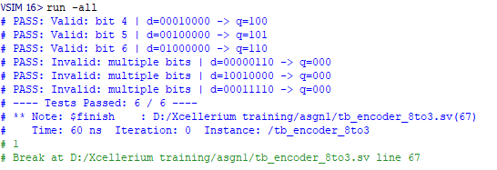

# TASK 1: Combinational Circuits Design and Testing  
**[XCELERIUM IC DESIGN TRAINING AND INTERNSHIP]**

## Author
**Hammad Qamar (EL-22074)**  
Electronics Department  
NED University of Engineering & Technology, Karachi  

---

## Overview
This repository contains the implementation and verification of basic combinational digital circuits developed as part of **Task 1** of the **Xcelerium IC Design Training and Internship** program. The project focuses on RTL design using **SystemVerilog** and functional verification using **directed testbenches**.

---

## Implemented Modules
The following combinational circuits are designed and verified:

- **32-bit Adder**
- **32-bit Barrel Shifter**
- **8-to-3 Encoder**

Each module has a dedicated testbench to validate its functionality.

---

## Verification Strategy
The testbenches are written using **directed testing methodology**, including:
- Fixed directed test cases
- Random input test cases
- Edge case validation  

Simulation results are observed to ensure correctness of logic under all scenarios.

---

---

## Simulation Results

HDL codes for the following modules and there respected testbench are uploaded above, for which following are the simulated results:

### 32-bit Adder Test Result

### 32-bit Barrel Shifter Test Result

### 8-to-3 Encoder Test Result

---

## Tools & Language
- **SystemVerilog**
- RTL Simulation (ModelSim / QuestaSim compatible)

---

## Notes
This project emphasizes clean RTL coding practices, modular design, and basic verification concepts.

